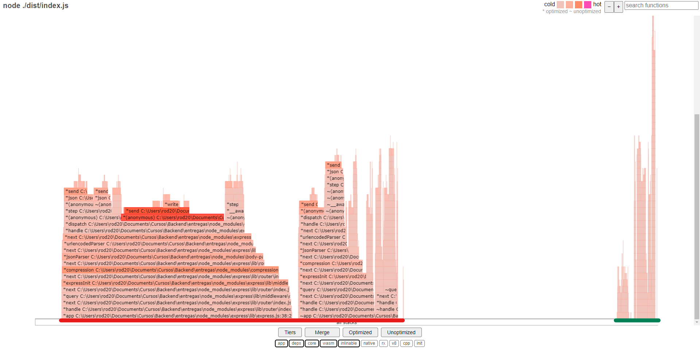

# Proyecto BACKEND para CoderHouse

## Entrega 32
* \[[`app.ts 109-146`][1]] Rutas de información de la API bloqueante y no bloqueante

###  Node.js profiler
Resultados de la ejecución de la aplicación:
* Ruta bloqueante:
```log
     [Summary]:
   ticks  total  nonlib   name
      4    0.7%   80.0%  JavaScript
      0    0.0%    0.0%  C++
      3    0.5%   60.0%  GC
    568   99.1%          Shared libraries
      1    0.2%          Unaccounted
```
* Ruta no bloqueante:
```log
 [Summary]:
   ticks  total  nonlib   name
      1    0.2%  100.0%  JavaScript
      0    0.0%    0.0%  C++
      5    1.0%  500.0%  GC
    495   99.8%          Shared libraries

```
La ruta no bloquante presenta una menor cantidad de ticks que la ruta bloqueante.
[1]: ./src/app.ts#L109-146


###  Artillery test
Resultados de la ejecución de la aplicación:
* Ruta bloqueante:
```log
  Scenarios launched:  50
  Scenarios completed: 50
  Requests completed:  1000
  Mean response/sec: 250
  Response time (msec):
    min: 4
    max: 298
    median: 148
    p95: 189
    p99: 202.5
  Scenario counts:
    0: 50 (100%)
  Codes:
    200: 1000
```
* Ruta no bloqueante:
```log
  Scenarios launched:  50
  Scenarios completed: 50
  Requests completed:  1000
  Mean response/sec: 671.14
  Response time (msec):
    min: 0
    max: 18
    median: 0
    p95: 1
    p99: 3
  Scenario counts:
    0: 50 (100%)
  Codes:
    200: 1000
```
El tiempo de respuesta de la ruta no bloqueante es menor que la ruta bloqueante.


###  0x Flamegraph
Resultados de la ejecución de la aplicación:
  
El grafico muestra el tiempo de ejecucion de cada funcion. Mas ancho el grafico, mas lento se ejecuta la funcion.\
El color `rojo` indica la ruta bloqueante con console.log, el color `verde` indica la ruta sin bloqueo.

### Chrome DevTools
Resultados de la ejecución de la aplicación:
  
La imagen muestra los tiempor de respuesta de cada ruta.

### Resultados:
Por lo que se puede observar, la runa no bloqueante posee una mayor performance que la ruta bloqueante.

## Informacion :
* Las entregas se encuentran en sus respectivas branches.
* Si se cambia de rama hacer un npm clean-install
* Rutas :

        https://localhost:8080/
        
        http://localhost:8080/productos
        
        http://localhost:8080/carrito

    Agregar datos a las bases de datos:

        https://localhost:8080/mockdata

